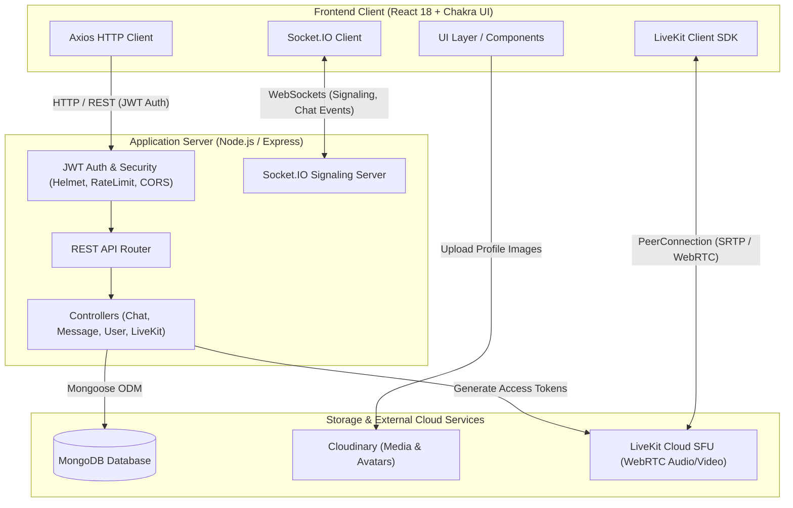
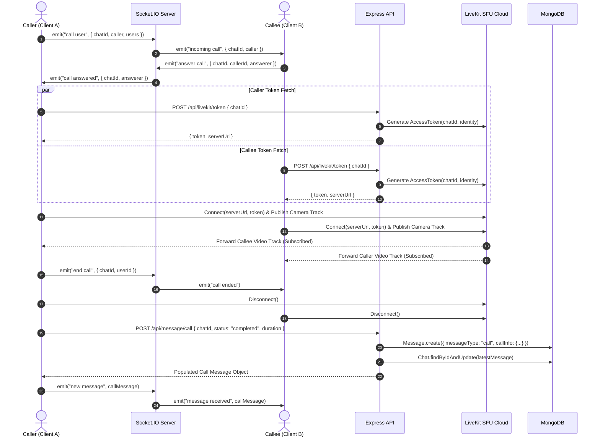
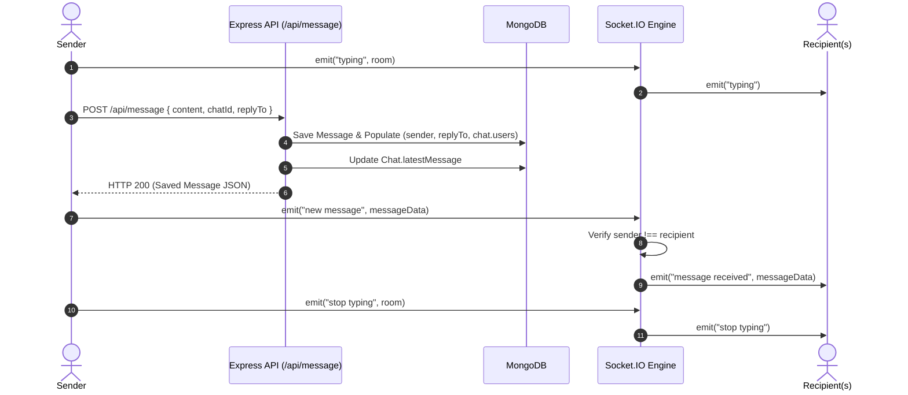
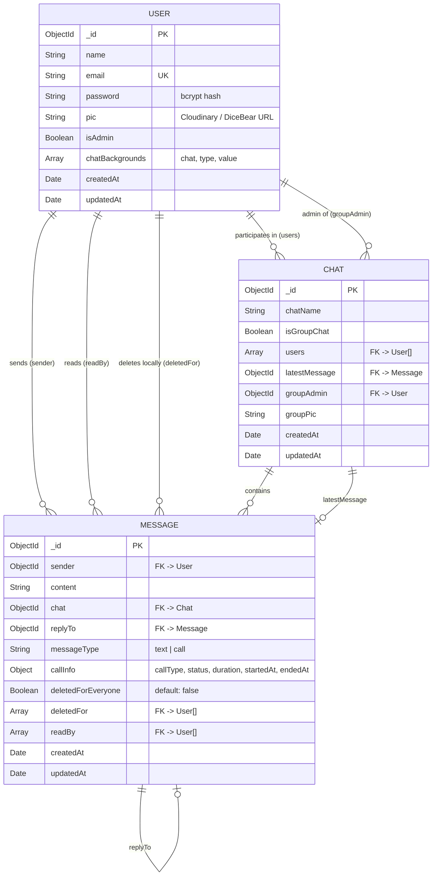

# 👾 YapMonster

<p align="center">
  
</p>

<p align="center">
  <b>A modern, enterprise-grade real-time communication platform featuring instant messaging, WebRTC group video calling, call history tracking, message quoting, and custom chat styling.</b>
</p>

<p align="center">
  
  
  
  
  
  
</p>

---

## 📑 Table of Contents

- [Overview](#-overview)
- [Key Features](#-key-features)
- [System Architecture](#-system-architecture)
  - [High-Level System Architecture](#1-high-level-system-architecture)
  - [Low-Level Video Call Signaling & SFU Pipeline](#2-low-level-video-call-signaling--sfu-pipeline)
  - [Low-Level Real-Time Messaging & Broadcast Pipeline](#3-low-level-real-time-messaging--broadcast-pipeline)
  - [Database Entity Relationship Diagram (ERD)](#4-database-entity-relationship-diagram-erd)
- [Tech Stack](#-tech-stack)
- [Directory Structure](#-directory-structure)
- [API Reference](#-api-reference)
- [Socket.IO Events Specification](#-socketio-events-specification)
- [Environment Variables](#-environment-variables)
- [Installation & Getting Started](#-installation--getting-started)
- [Security & Performance Optimizations](#-security--performance-optimizations)

---

## 🚀 Overview

**YapMonster** is a full-stack real-time collaboration application designed for seamless messaging and low-latency HD video conferencing. Built on the **MERN** stack and powered by **Socket.IO** and **LiveKit WebRTC SFU**, YapMonster combines the speed of WebSocket communication with scalable selective-forwarding video streams.

---

## ✨ Key Features

### 💬 Instant Messaging & Collaboration
- **Real-Time 1-on-1 & Group Chats**: Dynamic group creation, admin permissions, and participant management.
- **Typing Indicators & Live Presence**: Real-time typing feedback using debounced socket triggers.
- **Message Reply & Quoting**: Seamless reply threads with preview quotes of parent messages.
- **Dual-Mode Message Deletion**:
  - `Delete for Me`: Hides message locally per user account.
  - `Delete for Everyone`: Broadcasts real-time tombstones across all client instances.
- **Smart Date Dividers & 12-Hour Timestamps**: Floating day indicators (*Today*, *Yesterday*, formatted date pills) and precise message timestamps.
- **Chat Customization**: Per-conversation custom backgrounds (solid hex palette or custom wallpaper images).

### 📹 WebRTC & LiveKit HD Video Calling
- **1-on-1 & Multi-Party Video Calls**: Seamless, zero-setup WebRTC room generation via LiveKit Cloud SFU.
- **Real-Time Call Ringing & Notifications**: Incoming call modal with ambient ring pulse and accept/decline actions.
- **Responsive Layout Engine**: Dynamic side-by-side split screen for 1-on-1 calls and responsive multi-tile grid for group conferences.
- **Media Controls**: Real-time camera toggle, microphone mute/unmute, and screen-sharing support.

### 📞 Real-Time Call History in Chat Feed
- **Automated Lifecycle Logging**:
  - **Completed Calls**: Computes exact call duration in minutes and seconds (`📹 Video Call • 4m 12s`).
  - **Missed Calls**: Tracks unreceived or timed-out calls (`📹 Missed Video Call`).
  - **Declined Calls**: Real-time logging when recipient declines (`📹 Call Declined`).
- **One-Click Call Back**: Interactive call cards with quick action buttons to instantly re-initiate video calls.

---

## 🏗 System Architecture

### 1. High-Level System Architecture

The following diagram illustrates how frontend clients interact with the Express API server, Socket.IO WebSocket cluster, MongoDB database, Cloudinary CDN, and the LiveKit WebRTC SFU infrastructure:



---

### 2. Low-Level Video Call Signaling & SFU Pipeline

This sequence diagram details the full lifecycle of an outgoing call, signaling exchanges, token generation, media track publishing, and call history logging upon completion:



---

### 3. Low-Level Real-Time Messaging & Broadcast Pipeline

This diagram explains how messages, replies, typing status, and deletions propagate through the system in real-time:



---

### 4. Database Entity Relationship Diagram (ERD)

The relational model connecting Users, Chats, Messages, and Customizations:



---

## 🛠 Tech Stack

| Domain | Technology | Description |
| :--- | :--- | :--- |
| **Frontend Framework** | React 18 (`react`, `react-dom`) | Declarative component UI layer |
| **Styling & Design** | Chakra UI (`@chakra-ui/react`), Emotion, Framer Motion | Accessible, responsive, glassmorphic theme |
| **Real-Time Video** | LiveKit WebRTC (`@livekit/components-react`, `livekit-client`) | SFU-powered scalable video rooms |
| **WebSocket Engine** | Socket.IO Client (`socket.io-client`) | Bidirectional low-latency event communication |
| **Backend Runtime** | Node.js & Express.js | REST API & WebSocket server |
| **Database & ODM** | MongoDB & Mongoose 8 | Document database with schema validation |
| **Authentication** | JSON Web Tokens (`jsonwebtoken`), `bcryptjs` | Stateless bearer token authentication |
| **Media & CDN** | Cloudinary REST API | Cloud image uploads & profile asset management |
| **Security & Utilities**| `helmet`, `cors`, `express-rate-limit`, `morgan` | Production defense-in-depth and request logging |

---

## 📁 Directory Structure

```
YapMonster/
├── backend/
│   ├── config/
│   │   ├── db.js                   # MongoDB connection configuration
│   │   └── generateToken.js        # JWT creation helper
│   ├── controllers/
│   │   ├── chatControllers.js      # Group & 1-on-1 chat logic
│   │   ├── livekitControllers.js   # LiveKit Room token generation
│   │   ├── messageControllers.js   # Messages, call logs, & deletion
│   │   └── userControllers.js      # Auth, search, & background themes
│   ├── middleware/
│   │   ├── authMiddleware.js       # JWT authorization protection
│   │   └── errorMiddleware.js      # 404 & global error handlers
│   ├── models/
│   │   ├── chatModel.js            # Chat schema
│   │   ├── messageModel.js         # Message & Call schema
│   │   └── userModel.js            # User & Background schema
│   ├── routes/
│   │   ├── chatRoutes.js           # /api/chat endpoints
│   │   ├── livekitRoutes.js        # /api/livekit endpoints
│   │   ├── messageRoutes.js        # /api/message endpoints
│   │   └── userRoutes.js           # /api/user endpoints
│   ├── server.js                   # Express server & Socket.IO events
│   └── package.json
│
└── frontend/
    ├── public/                     # Static assets & index.html
    └── src/
        ├── components/
        │   ├── Authentication/     # Login & Signup tabs
        │   ├── miscellaneous/      # SideDrawer, ProfileModal, GroupModal, ChatCustomizer
        │   ├── userAvatar/         # UserListItem & UserBadgeItem
        │   ├── VideoCall/          # CustomVideoRoom, VideoTile, IncomingCallModal, VideoCallModal
        │   ├── ChatBox.js          # Chat view wrapper
        │   ├── ChatLoading.js      # Skeleton loading states
        │   ├── MyChats.js          # Sidebar chat list & preview timestamps
        │   ├── ScrollableChat.js   # Chat bubbles, Call History cards, Date dividers
        │   └── SingleChat.js       # Chat container, typing, socket lifecycle
        ├── Context/
        │   └── ChatProvider.js     # React Context state (user, selectedChat, notifications)
        ├── config/
        │   ├── ChatLogics.js       # Sender name/avatar helper utilities
        │   └── config.js           # Environment & Backend URL configuration
        ├── App.js                  # Route definitions
        ├── index.js                # App bootstrap & ChakraProvider
        └── package.json
```

---

## 📡 API Reference

### 🔐 Authentication & Users (`/api/user`)
| Method | Endpoint | Auth | Description |
| :--- | :--- | :---: | :--- |
| `POST` | `/api/user` | Public | Register new user account |
| `POST` | `/api/user/login` | Public | Authenticate user & receive JWT |
| `GET` | `/api/user?search=query` | Bearer | Search registered users by name or email |
| `PUT` | `/api/user/profile` | Bearer | Update user profile name and avatar |
| `GET` | `/api/user/chat-background/:chatId` | Bearer | Retrieve custom wallpaper for a chat |
| `PUT` | `/api/user/chat-background/:chatId` | Bearer | Set custom color/image wallpaper |

### 💬 Chat Management (`/api/chat`)
| Method | Endpoint | Auth | Description |
| :--- | :--- | :---: | :--- |
| `POST` | `/api/chat` | Bearer | Access or create 1-on-1 conversation |
| `GET` | `/api/chat` | Bearer | Fetch all conversations for the authenticated user |
| `POST` | `/api/chat/group` | Bearer | Create a new group chat |
| `PUT` | `/api/chat/rename` | Bearer | Rename a group chat (Admin only) |
| `PUT` | `/api/chat/groupadd` | Bearer | Add user to group (Admin only) |
| `PUT` | `/api/chat/groupremove` | Bearer | Remove user from group or leave group |
| `PUT` | `/api/chat/update-picture` | Bearer | Update group display picture (Admin only) |
| `DELETE`| `/api/chat/:chatId` | Bearer | Delete entire conversation |

### 📨 Messages & Call Logs (`/api/message`)
| Method | Endpoint | Auth | Description |
| :--- | :--- | :---: | :--- |
| `GET` | `/api/message/:chatId` | Bearer | Fetch all message history for a chat |
| `POST` | `/api/message` | Bearer | Send a text message (optional `replyTo`) |
| `POST` | `/api/message/call` | Bearer | Record a completed, missed, or declined call |
| `DELETE`| `/api/message/:messageId` | Bearer | Delete message for everyone (tombstone) |
| `PUT` | `/api/message/delete-for-me`| Bearer | Delete message for current user only |

### 📹 WebRTC & LiveKit Tokens (`/api/livekit`)
| Method | Endpoint | Auth | Description |
| :--- | :--- | :---: | :--- |
| `POST` | `/api/livekit/token` | Bearer | Generate LiveKit JWT room access token |

---

## ⚡ Socket.IO Events Specification

| Event Name | Direction | Payload | Description |
| :--- | :---: | :--- | :--- |
| `setup` | Client $\rightarrow$ Server | `userData` | Registers user's active socket session |
| `connected` | Server $\rightarrow$ Client | - | Acknowledges socket connection |
| `join chat` | Client $\rightarrow$ Server | `roomId` | Joins a specific chat room channel |
| `typing` | Client $\rightarrow$ Server | `roomId` | Emits typing state to other chat members |
| `stop typing` | Client $\rightarrow$ Server | `roomId` | Clears typing indicator |
| `new message` | Client $\rightarrow$ Server | `newMessageReceived` | Relays incoming message/call to chat users |
| `message received` | Server $\rightarrow$ Client | `messageObject` | Delivers new message or call log |
| `delete message` | Client $\rightarrow$ Server | `{ chatId, messageId, forEveryone }` | Signals message deletion event |
| `message deleted` | Server $\rightarrow$ Client | `{ messageId, forEveryone }` | Synchronizes deletion across clients |
| `call user` | Client $\rightarrow$ Server | `{ chatId, caller, isGroupChat, ... }` | Dispatches incoming call alerts |
| `incoming call` | Server $\rightarrow$ Client | `{ chatId, caller, isGroupChat }` | Prompts incoming call modal on callee |
| `answer call` | Client $\rightarrow$ Server | `{ chatId, callerId, answerer }` | Signals that callee accepted the call |
| `call answered`| Server $\rightarrow$ Client | `{ chatId, answerer }` | Notifies caller to start active stream |
| `reject call` | Client $\rightarrow$ Server | `{ chatId, callerId, rejecter }` | Signals that callee declined call |
| `call rejected`| Server $\rightarrow$ Client | `{ chatId, rejecter }` | Notifies caller that call was declined |
| `end call` | Client $\rightarrow$ Server | `{ chatId, userId }` | Broadcasts hang-up signal to room |
| `call ended` | Server $\rightarrow$ Client | `{ chatId, userId }` | Closes active call modal for peers |

---

## 🔐 Environment Variables

### Backend Configuration (`backend/.env`)
```env
PORT=5000
MONGO_URI=mongodb+srv://<username>:<password>@cluster.mongodb.net/yapmonster?retryWrites=true&w=majority
JWT_SECRET=your_super_secret_jwt_key
FRONTEND_URL=http://localhost:3000
NODE_ENV=development

# LiveKit WebRTC Configuration
LIVEKIT_API_KEY=your_livekit_api_key
LIVEKIT_API_SECRET=your_livekit_api_secret
LIVEKIT_URL=wss://your-project.livekit.cloud
```

### Frontend Configuration (`frontend/.env`)
```env
REACT_APP_BACKEND_URL=http://localhost:5000
```

---

## 📦 Installation & Getting Started

### 1. Clone the Repository
```bash
git clone https://github.com/akkuraina/mergo.git
cd mergo
```

### 2. Configure Backend
```bash
cd backend
npm install
# Create .env and populate environment variables
npm start
```

### 3. Configure Frontend
```bash
cd ../frontend
npm install
# Create .env and configure REACT_APP_BACKEND_URL
npm start
```

Open [http://localhost:3000](http://localhost:3000) in your browser to start chatting!

---

## 🛡 Security & Performance Optimizations

- **Helmet Security**: Sanitizes and sets security-related HTTP headers against XSS and clickjacking.
- **Strict Rate Limiting**: Dedicated rate limiter on auth routes (`/api/user/login`) and API endpoints to prevent brute-force attacks.
- **Hardware-Aware WebRTC**: Automatic handling of camera device timeouts (`AbortError`), graceful camera fallbacks, and track subscription cleanups.
- **Optimized MongoDB Indexing**: Compound indexes on `chat` and `sender` fields for sub-millisecond message query resolution.
- **Tombstone Data Preservation**: Soft-deletion mechanism preserving conversation integrity while honoring user privacy.

---

